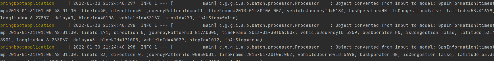

# GPS Track Information

## Technologies used

 - **Java 8 - MongoDB - Spring Batch - Swagger - Lombok - Spring boot - Spring Web - Python**

## What the application does
Script python will download a dataset from Dublin City Council, extract the csv files, delete all and when only one remains, will move to resource Spring application folder.
When Springboot application start, Spring Batch will processe this file, convert it and save on MongoDB.

## What you'll need to run it

 - Python 3.9 in the Windows system variables [Link to download on Windows](https://www.python.org/downloads/release/python-3910/)
 - Docker [How to install Docker on Windows](https://docs.docker.com/desktop/windows/install/)
 - docker-compose - *Docker Desktop for Windows includes Compose along with other Docker apps*
 - Java SDK 1.8 Configured in the Windows Variables - [How to install on Windows](https://mkyong.com/java/how-to-set-java_home-on-windows-10/)
 - Maven configured in the Windows system variables - [How to install on Windows](https://mkyong.com/maven/how-to-install-maven-in-windows/)

### How to run the project

 - Clone this project
 - After cloned, navigate to the project root folder
 - Run the script: *start.sh*
 - Waiting to the application starting process the data

 ### How to use

- When you see a message like this in the terminal, please follow the step below
- Go to: http://localhost:8080/swagger-ui.html and use the filter as you want